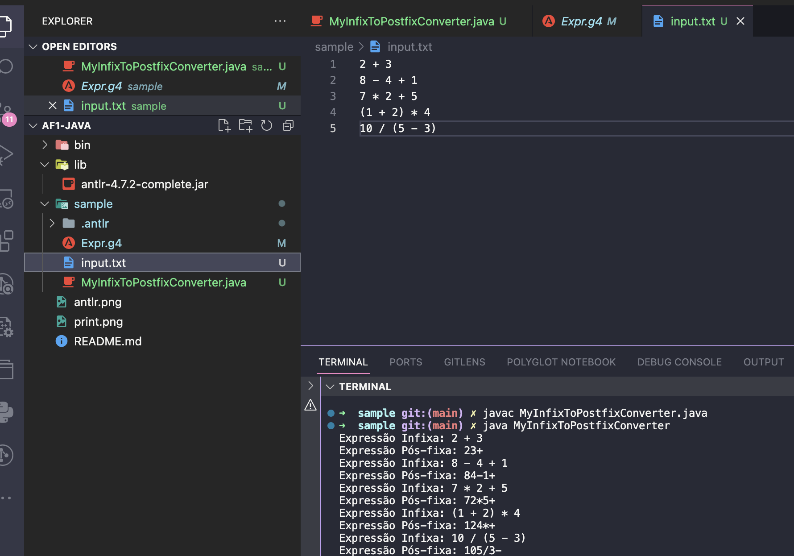
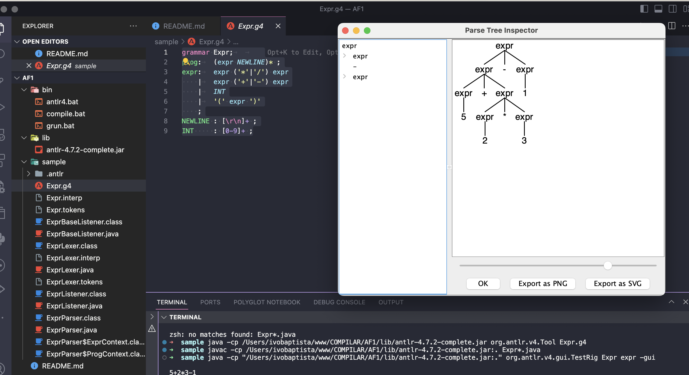

<h1 align="center">
    
</h1>

ANTLR com Java

# TESTE com ANTLR e Java
    

📌 ANTLR com Java: AF1 e Visualização da Árvore de Análise
------------------
Este guia descreve como criar, analisar e visualizar uma árvore de análise para uma gramática simples de "AF1" utilizando ANTLR para gerar os analisadores e Java para executar a análise e a visualização.

Este guia passo a passo descreve como criar uma simples gramática usando ANTLR, gerar o analisador em Java, e visualizar a árvore de análise sintática.

## Pré-requisitos

- Java (para executar o ANTLR).
- ANTLR4 (baixe `antlr-4.x-complete.jar` do [site oficial do ANTLR](https://www.antlr.org/)).

## Passo a Passo

Codigo 

### 1. Criar a Gramática ANTLR

Definimos a gramática no arquivo `Expr.g4`:
 
## 2. Gerar os Ficheiros Python com ANTLR

- **`java`**: Este é o comando para executar aplicações Java.
- **`cp`**: A opção **`cp`** ou **`classpath`** especifica a lista de diretórios, JAR archives, e ZIP archives para procurar classes e recursos.
- **`/Users/ivobaptista/www/COMPILAR/antlr4/lib/antlr-4.7.2-complete.jar`**: Este é o caminho para o arquivo JAR do ANTLR. Este arquivo contém todas as classes necessárias para executar a ferramenta ANTLR.
- **`org.antlr.v4.Tool`**: Este é o nome qualificado da classe principal do ANTLR que executa a ferramenta.
- **`Expr.g4`**: Este é o nome do arquivo de gramática ANTLR. ANTLR gera código Java a partir desta gramática que pode analisar e construir uma árvore de análise para o linguagem definida pela gramática.

<pre>java -cp /Users/ivobaptista/www/COMPILAR/AF1/lib/antlr-4.7.2-complete.jar org.antlr.v4.Tool Expr.g4</pre>

Certifique-se de substituir /caminho/para/antlr-4.x-complete.jar pelo caminho real onde o arquivo antlr-4.x-complete.jar está localizado no seu sistema.

## 3. Executar ANTLR4 Parser Generator (compilação dos arquivos Java gerados):

- **`javac`**: Este é o compilador Java, usado para compilar arquivos **`.java`** em bytecode **`.class`**.
- **`cp`**: Novamente, especifica o caminho de busca para classes e recursos. Neste caso, inclui tanto o JAR do ANTLR quanto o diretório atual (representado por **`.`**) para que o compilador possa encontrar tanto as classes do ANTLR quanto os arquivos **`.java`** gerados anteriormente.
- **`Expr*.java`**: Este padrão seleciona todos os arquivos Java no diretório atual que começam com "Expr". Estes são os arquivos gerados pelo comando anterior.

<pre> javac -cp /Users/ivobaptista/www/COMPILAR/AF1/lib/antlr-4.7.2-complete.jar:. Expr*.java </pre>

## 4. Executar o TestRig do ANTLR para testar a gramática:

- **`java`**: Executa aplicações Java.
- **`cp`**: Especifica o caminho para as classes e recursos, semelhante aos comandos anteriores.
- **`org.antlr.v4.gui.TestRig`**: Esta é a classe do ANTLR que fornece uma interface gráfica para testar gramáticas. É uma ferramenta útil para visualizar árvores de análise geradas a partir de entrada específica.
- **`Expr`**: Este é o nome da gramática a ser testada. Deve corresponder ao nome dado no arquivo **`.g4`**.
- **`expr`**: Este é o nome da regra dentro da gramática **`Expr.g4`** que você deseja testar. A ferramenta **`TestRig`** irá analisar a entrada conforme esta regra.
- **`-gui`** indica ao **`TestRig`** para abrir uma interface gráfica mostrando a árvore de análise.

<pre> java -cp "/Users/ivobaptista/www/COMPILAR/AF1/lib/antlr-4.7.2-complete.jar:." org.antlr.v4.gui.TestRig Expr expr -gui </pre>

Deve aparecer a visualização da árvore de análise sintática

O projeto foi feito em Java com ANTLR

The project was done with Java with ANTLR

🔧 Tecnologias utilizadas:
------------------

- ANTLR 
- VS code

💬 Fale comigo
------------------
[*Entre em contato comigo*](https://www.linkedin.com/in/ivo-baptista-3712144/)

